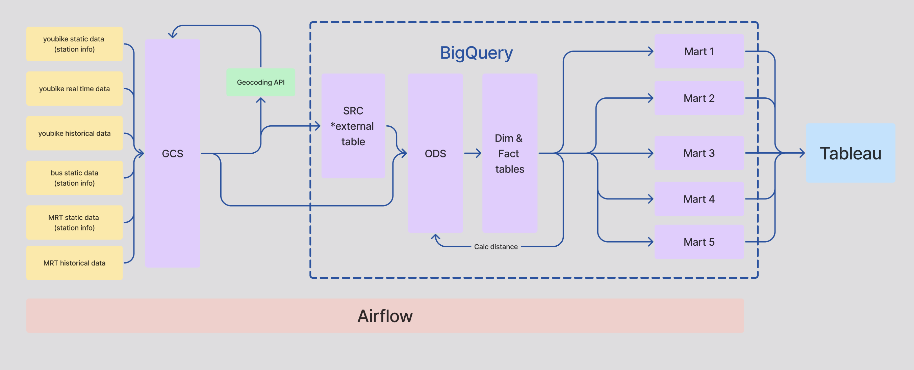

# Taipei-transit-data_hub

用資料工程和大數據對於台北市大眾運輸工具的深度探勘和分析

## 架構圖


## 資料量

## setup

### run Airflow
```
cd airflow
docker-compose up airflow-init
docker-compose up -d
```

### Use utils outside of airflow 
(e for editable)
```
cd airflow
pip install -e airflow

```

## Contributor 
In alphabetical order:
- Andy
- Harry
- Laura
- Taylor
- Harry: @harryhowiefish

