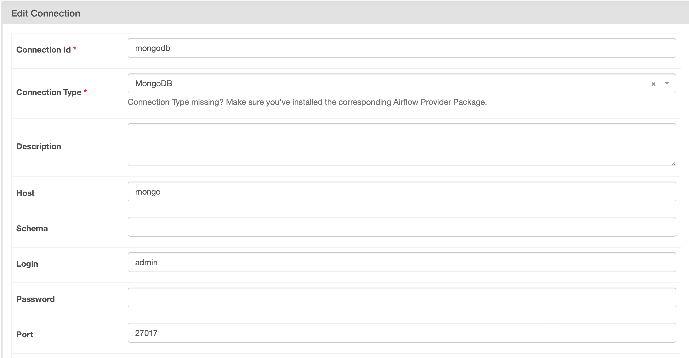

先跑CLI
```
docker-compose up airflow-init
docker-compose up -d 
```

到localhost:8000
帳密都是airflow

理論上crawler_with_pymongo就可以直接執行

如果要跑crawler_with_mongohook要做環境設定。到Admin > Connection 然後依照附圖把資料填進去，存檔後就可以跑這個DAG


